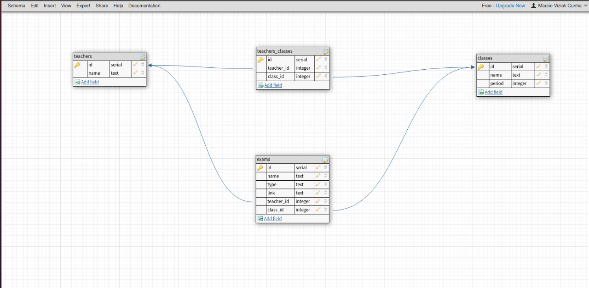

# Repoprovas

Bem vindo ao repoprovas, o intuito deste projeto era criar um site fullstack onde poderiam ser postadas provas e ver provas já postadas.

<h1> Tecnologias usadas </h1>

And typeORM

<h1> Como utilizar </h1>

Caso queira ver o deploy do projeto, pode encontrar na parte frontend dele:

<a href='https://github.com/MarcioVCunha/RepoProvas-Front'>Frontend</a>

Para utilizar um banco local, primeiro terá que baixar o repositório:

    git clone https://github.com/MarcioVCunha/RepoProvas-Back

Depois de baixar, você terá que criar um banco usando postgres, no próprio arquivo você encontrará o dump do banco (database.sql).

Depois de criar seu banco, terá que alterar o arquivo .env.example e colocar nele as configurações do seu banco, além disso, renomeio o arquivo para .env

Com o banco feito e já conectado, temos que instalar as dependencias

    npm i

também temos que criar o arquivo dist, para que podemos rodar o banco em Javascript

    npm run build

Finalmente, podemos inicializar nosso banco

    npm start

<h1> Adcionais </h1>

Foto do database:

